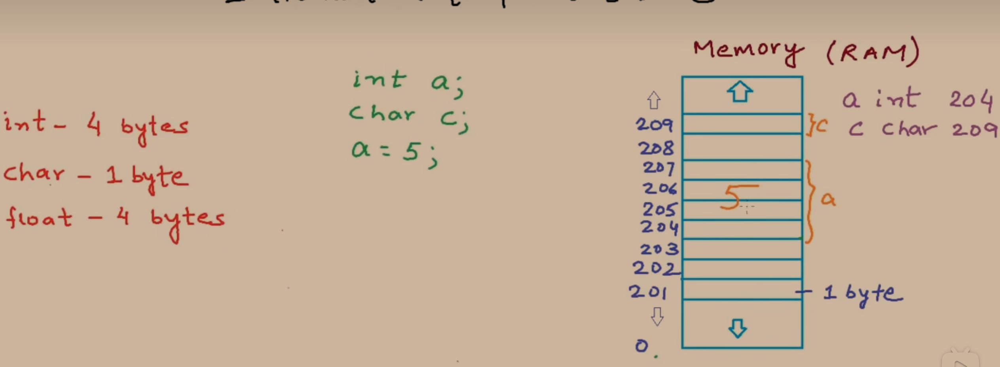
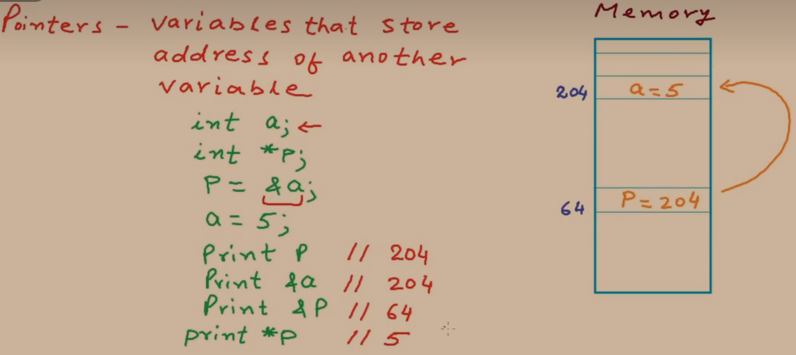
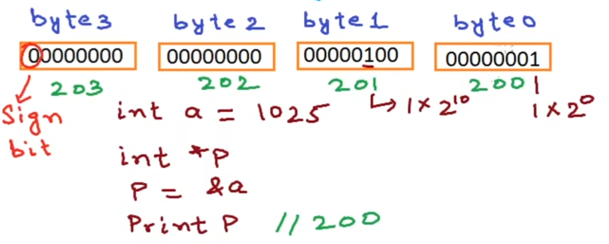
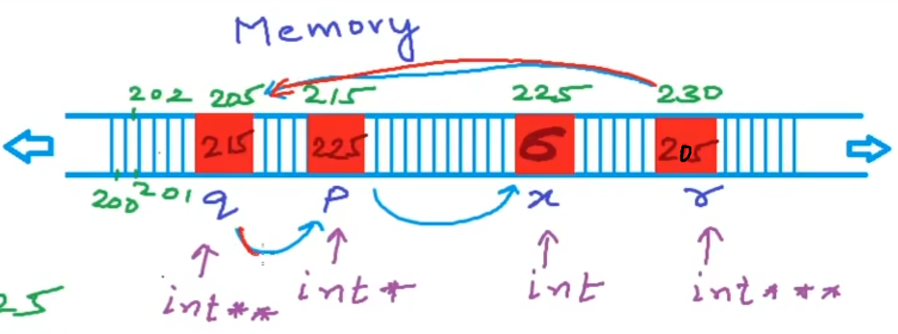
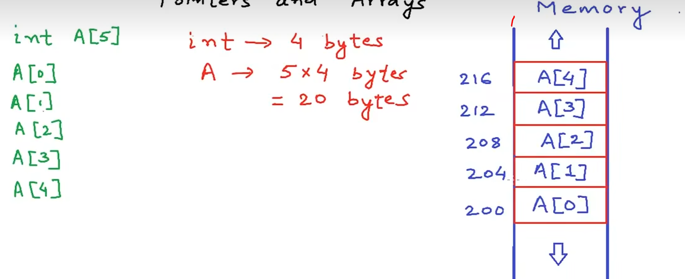
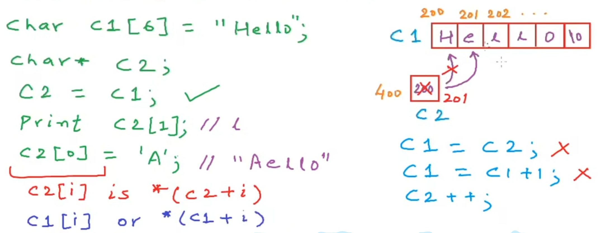
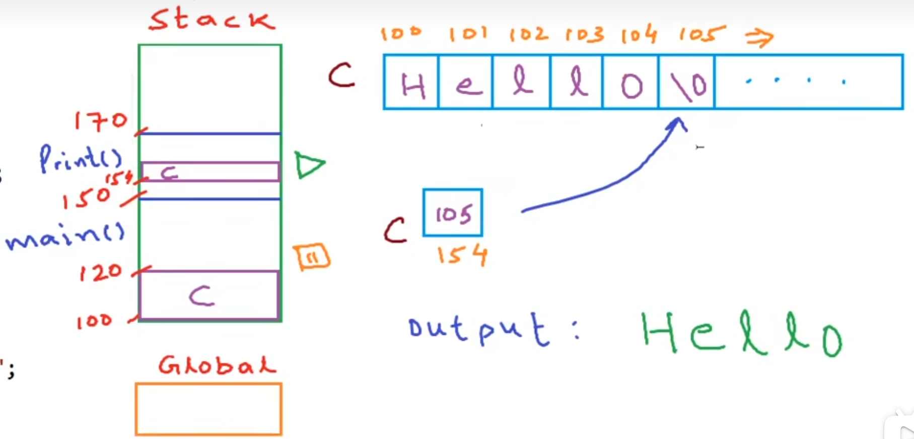
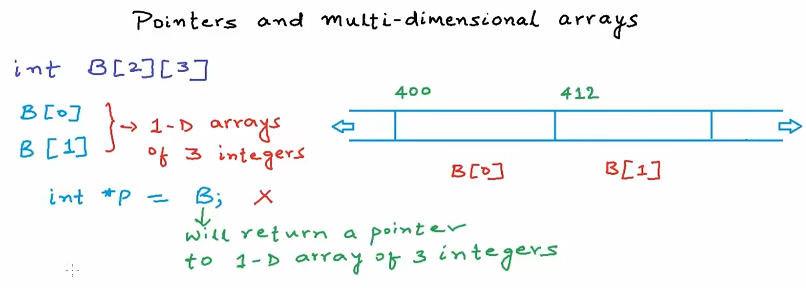

# 指针的基本介绍

## 指针是一个变量，用来存放其他变量在内存中的地址

## 1.变量在内存中的表示



```c
# include <stdio.h>

int main(void) {
    printf("hello, pointer\n");
    int* pointer;
    
    int a;
    int* p;
    p = &a;
    a = 5;

    printf("%d\n", sizeof(pointer));
    printf("%d\n", p);
    printf("%d\n", &a);
    printf("%d\n", a);
    printf("%d", *p);
    return 0;
}

/*
hello, pointer
8
6422036
6422036
5
5
*/
```



```c
# include <stdio.h>

int main(void) {
    int a = 5;
    int* p = &a;
    *p = 6;
    printf("%d\n", a);
    printf("%d\n", &a);
    printf("%d\n", p);
    printf("%d\n", p + 1);  //int类型的指针占四个字节，此处p + 1是下一个int类型指针的首地址，即相差4个字节
}

/*
6
6422036
6422036
6422040
*/
```

> [!NOTE]
>
> print *p：解引用，对应 指针向量p所指向的地址 对应的 值

## 2.不同类型的指针转换

```c
# include <stdio.h>

int main(void) {
    int a = 1025;
    int* p;
    p = &a;
    printf("int类型所占字节数：%d\n", sizeof(int));
    printf("p的地址：%d, *p的值：%d\n", p, *p);
    printf("p + 1的地址：%d, *(p + 1)的地址：%d\n", p + 1, *(p + 1));
    char* p0;
    p0 = (char*)p;	//强制类型转换
    printf("char类型所占字节数：%d\n", sizeof(char));
    printf("p0的地址：%d, p0的值：%d\n", p0, *p0);
    printf("p0 + 1的地址：%d, *(p0 + 1)的地址：%d", p0 + 1, *(p0 + 1));
}

/*
int类型所占字节数：4
p的地址：6422028, *p的值：1025
p + 1的地址：6422032, *(p + 1)的地址：11427072
char类型所占字节数：1
p0的地址：6422028, p0的值：1
p0 + 1的地址：6422029, *(p0 + 1)的地址：4
*/
```

图解：



> [!NOTE]
>
> char 类型占 1 个字节，所以 p0 指向内存中的一个地址（此地址占 1 个字节），而原来的 1025 是 int 类型，占 4 个字节，所以 p0 指向 1025  4 个字节中的最后一个字节00000001，所以*p0 = 1；p0 + 1 指向p0下一个字节，即00000100，即4

## 3.指向指针的指针

```c
# include <stdio.h>

int main(void) {
    int x = 5;
    int* p = &x;
    *p = 6;
    int** q = &p;
    int*** r = &q;
    printf("*p = %d\n", *p);
    printf("*q = %d\n", *q);
    printf("**q = %d\n", **q);
    printf("**r = %d\n", **r);
    printf("***r = %d\n", ***r);

    ***r = 10;
    printf("x = %d\n", x);
    **q = *p + 2;
    printf("x = %d\n", x);

}

/*
*p = 6
*q = 6422036
**q = 6
**r = 6422036
***r = 6
x = 10
x = 12
*/
```

图解：



## 4.实际指针用例

### 4.1函数传值和值传值

```c
# include <stdio.h>
/*错误写法
void Increment(int a) {
    a = a + 1;
}
int main(void) {
    int a = 10;
    Increment(a);
    printf("调用函数之后a = %d", a);    //此处a = 10
}

*/

//正确写法
int Interment(int* p) {
    *p = *p + 1;
}

int main(void) {
    int a = 10;
    int* p = &a;
    Interment(p);
    printf("调用函数之后a = %d", a);    //此处a = 11
}


```

> [!NOTE]
>
> 当我们使用指针进行函数传值的时候就是传引用，传引用可以节省很多内存空间

## 5.指针和数组

### 5.1数组取地址和取值的方法



```c
# include <stdio.h>

int main(void) {
    int a[5]= {8, 11, 70, 48, 52};
    printf("数组a的首地址是：%d\n", a);
    printf("数组a的第一个值是：%d\n", *a);

    printf("数组a的第二个元素的地址是：%d\n", a + 1);
    printf("数组a的第二个元素的值是：%d\n", *(a + 1));

    //也可表示成
    printf("数组a的第三个元素的地址是：%d\n", &a[2]);
    printf("数组a的第三个元素的值是：%d", a[2]);
}

/*
数组a的首地址是：6422016
数组a的第一个值是：8
数组a的第二个元素的地址是：6422020
数组a的第二个元素的值是：11
数组a的第三个元素的地址是：6422024
数组a的第三个元素的值是：70
*/
```

### 5.2数组作为函数参数传入

对于数组来说，不适用传值方法，总是传引用

数组作为参数传入时，传入的是数组的首地址：即当编译器看到数组作为函数参数的时候，它不会拷贝整个数组，而是仅仅创建一个同名的指针（创建数组类型的指针），形参传进去的是数组的首地址

```c
# include <stdio.h>

int array(int a[], int size) {        //这里int a[] 可以写成 int* a
    int sum = 0;
    printf("in array, size of a = %d, size of a[0] = %d\n", sizeof(a), sizeof(a[0]));
    for(int i = 0; i < size; i++) {
        sum += a[i];        //a[i] = *(a + i), 是对应的数组的值
    }
    return sum;
}

int main(void) {
    int a[5] = {1, 2, 3, 4, 5};
    int size = sizeof(a) / sizeof(a[0]);
    int total = array(a, size);
    printf("sum = %d\n", total);
    //这里64位系统，sizeof(a)是 8 位
    printf("in main, size of a = %d, size of a[0] = %d\n", sizeof(a), sizeof(a[0]));
}

/*
in array, size of a = 8, size of a[0] = 4
sum = 15
in main, size of a = 20, size of a[0] = 4
*/
```

> [!IMPORTANT]
>
> **很多语言，像C、Java在涉及函数（方法）时，函数（方法）在 栈 中新开辟一个空间，运行结束后这块空间就消失不见~回到main函数（方法）继续运行。所以在函数中的运行不调用指针的话，返回main函数会没有效果**

### 5.3字符数组

字符数组的空间要 >= 字符的数量 + 1（因为结尾有 "\0"）

```c
# include <stdio.h>

int main(void) {
    char C1[4];
    C1[0] = 'j';
    C1[1] = 'o';
    C1[2] = 'h';
    C1[3] = 'n';
    printf("%s\n", C1);
    char C[5];		//注意此处
    C[0] = 'j';
    C[1] = 'o';
    C[2] = 'h';
    C[3] = 'n';
    printf("%s", C);
}

/*
john�\�
john
*/
```



```c
//用while循环和函数实现数组的输出

# include <stdio.h>

void printElement(char* a) {
    int i = 0;
    //第一种写法
    while(a[i] != '\0') {
        printf("%c\t", a[i]);
        i++;
    }
    printf("\n");

    /*	也可以写成
    while(*a != '\0') {
        printf("%c\t", *a);
        a++;
    }
    printf("\n");
    */
}

int main(void) {
    char a[20] = "hello";
    printElement(a);
}

/*
h	e	l	l	o
*/
```

其中，第二种的思路图解如下：



> [!NOTE]
>
> const：只读不可修改
>
> void printElement(char* a)这一个函数，可以修改为只可读取不能修改的函数：void printElement(const char* a)

### 5.4二维数组



二维数组是每个大数组里面有若干个小数组，像上图：两个大的数组，每个大数组里面有三个小数组，故 B[0] 和 B[1] 都占12个字节

> [!NOTE]
>
> 二维数组中，不能写 int* p = B; 因为此时的数组B返回的是一个指向一维数组（其中包含三个整形元素）的指针，而不是一个整形的指针

